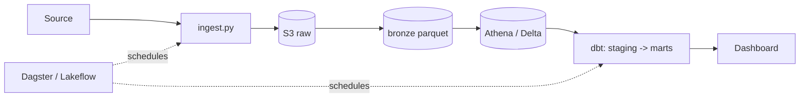
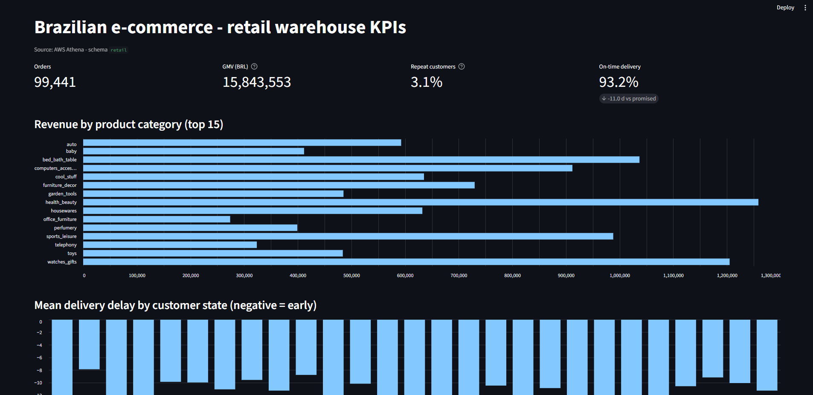

# <project-name>

> One-line business problem this pipeline solves.


## Problem

Who has the pain, what decision it unblocks, why the naive approach falls short. 3–4 lines.

## Architecture

See [`docs/architecture.md`](docs/architecture.md).



## Stack

`Python 3.11` · `Docker` · `dbt-core` · `Terraform` · `GitHub Actions` · *(cloud-specific: Athena/Glue or Databricks/Delta)*

## Run it in 5 minutes

```bash
git clone https://github.com/willamsburgoa-hash/<repo-name>.git
cd <repo-name>
cp .env.example .env            # fill in credentials
docker compose up --build       # ingest -> dbt build -> dashboard
# dashboard: http://localhost:8501
```

For the AWS footprint:

```bash
cd terraform && terraform init && terraform apply
# ... run pipeline ...
terraform destroy               # always, when done
```

## Results & insights

1. …
2. …
3. …



## Data quality

- dbt tests: `not_null`, `unique`, `relationships`, `accepted_values` (see `dbt/models/**/schema.yml`).
- *(if applicable)* Great Expectations / Soda suite gating `bronze`.

## What I'd improve next

- …

## Cost

Runs within the AWS credit plan / Databricks Free Edition. Data volume kept in the MB range;
Athena scans are pennies; `terraform destroy` leaves no standing resources. Measured spend: **< $1**.
