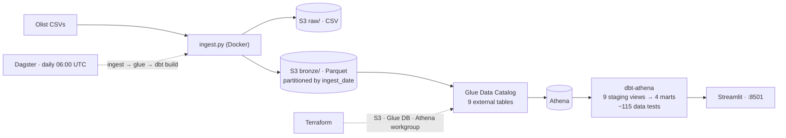

# ecommerce-retail-warehouse

> Daily sales & logistics KPIs for a Brazilian e-commerce marketplace — revenue by
> category, delivery performance, retention — on an AWS footprint that costs ~$0.


## Problem

A retail marketplace needs to see, every morning, how the business is doing:
what's selling, whether deliveries are hitting their promised dates, and whether
customers come back. Standing up a data warehouse (Redshift, Snowflake) for a
question this size is overkill and expensive. This project answers it with
pay-per-query Athena over Parquet in S3, transformed with dbt — reproducible,
tested, and cheap enough to run on AWS credits.

Source: the public [Olist Brazilian E-Commerce dataset](https://www.kaggle.com/datasets/olistbr/brazilian-ecommerce)
(~100k orders, 2016–2018, 9 relational tables).

## Architecture



Layers: `raw` (source CSV as-is) → `bronze` (Parquet, all columns typed as string,
partitioned by `ingest_date`) → `staging` (typed, renamed, one dbt view per source
table) → `marts` (`fct_orders`, `dim_customers`, `fct_delivery_performance`,
`mart_retention_cohorts`). More detail in [`docs/architecture.md`](docs/architecture.md).

## Stack

`Python 3.11` · `Docker` · `Terraform` · `AWS S3 + Glue + Athena` ·
`dbt-core` + `dbt-athena` · `Dagster` · `Streamlit` · `DuckDB` (CI) · `GitHub Actions`

## Run it in 5 minutes

**No AWS account needed** — builds a local DuckDB from the committed ~2 MB sample
and serves the dashboard off it:

```bash
git clone https://github.com/willamsburgoa-hash/ecommerce-retail-warehouse.git
cd ecommerce-retail-warehouse
docker compose up --build          # dbt seed→run→test on DuckDB, then the dashboard
# dashboard: http://localhost:8501
```

**Full pipeline on your own AWS account** (uses the AWS credit plan; ~$0 — see Cost):

```bash
cp .env.example .env                # fill AWS_* ; KAGGLE_* optional (else the sample is used)
cd terraform && terraform init && terraform apply && cd ..
docker compose --profile aws up --build   # ingest → glue → dbt build (Athena) + Dagster UI :3000
# ...
cd terraform && terraform destroy   # always, when done for the day
```

Without Docker: `uv venv && uv pip install -e ".[aws,dev]"`, then
`python scripts/ingest.py`, `python scripts/create_glue_tables.py`,
`dotenv run -- dbt build --project-dir dbt --profiles-dir dbt`.

## Results & insights


*99,441 orders · Sep 2016 – Oct 2018 · R$15.8M GMV*

1. **Retention is effectively zero.** Of 96.1k unique customers, only **3.1%**
   ever place a second order; month-1 repurchase is **0.5%**. This is a
   single-purchase marketplace — acquisition, not loyalty, drives revenue.
2. **Delivery ETAs are heavily padded.** 93% of orders arrive on time, but the
   average order lands **~11 days before** the promised date (actual transit ≈
   12 days). The customer-facing estimate is conservative by roughly 2×.
3. **Logistics quality is regional.** On-time rate falls to **79–85%** in the
   northeastern states (AL, MA, SE) versus 95%+ around São Paulo — a targeted
   carrier/SLA problem, not a systemic one.
4. **Revenue is broad, not concentrated.** The top category (health & beauty,
   R$1.26M) is only ~8% of GMV; the top 5 categories together are ~35%.
5. **Payments skew to credit card (79% of value) and boleto (18%)** — installment
   behaviour matters for cash-flow modelling.

## Data quality

- **~115 dbt tests**, four types: `not_null` / `unique` on every primary and
  surrogate key; `relationships` on every foreign key across staging *and* marts;
  `accepted_values` on `order_status` (8), `payment_type` (5), `review_score`
  (1–5) and Brazilian state codes (27, shared via a YAML anchor).
- **One known `warn`**: 2 source categories (`pc_gamer`,
  `portateis_cozinha_e_preparadores_de_alimentos`) have no row in the translation
  table — 13 products. Kept as `severity: warn`: a source gap, not a pipeline bug.
- **`stg_geolocation`** collapses ~1M raw lat/long points to one row per zip
  prefix so it joins cleanly as a dimension (documented modelling choice).
- **CI** runs the whole dbt graph (`seed → run → test`) on the committed sample
  via DuckDB, with no cloud credentials, on every push.

## What I'd improve next

- `dagster-dbt` integration for per-model asset lineage in the Dagster UI.
- Incremental `fct_orders` keyed on `ingest_date`, fed by a synthetic
  "today's orders" generator, to demo incremental loads.
- Partition projection on the bronze Glue tables (drop `MSCK REPAIR`).
- A Great Expectations / Soda gate on `bronze` before dbt runs.
- Publish `dbt docs` to GitHub Pages.

## Cost

| Item | Detail | Monthly |
|---|---|---|
| S3 storage | ~165 MB (raw CSV + bronze Parquet + marts) | ~$0.004 |
| Athena | Parquet + column pruning; a full `dbt build` scans a few MB | < $0.01 |
| Glue Data Catalog | ~22 tables, far under the 1M free-object limit | $0 |
| Glue crawlers / RDS / Redshift / EC2 | not used | $0 |

`terraform destroy` (`force_destroy = true`) removes everything after each
session; a **$5 AWS Budget alarm** guards the account; `athena-results/` has a
7-day lifecycle rule. Measured spend across the whole build: **under $0.10**.
