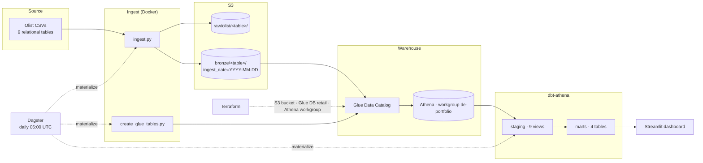

# Architecture

## Overview

The question is small and read-only: daily sales, delivery and retention KPIs over
~100k historical orders. That doesn't justify a running warehouse, so the design
is **files in S3 + a catalog + a query engine**: `ingest.py` lands the Olist
tables as partitioned Parquet in S3, the Glue Data Catalog describes them, Athena
queries them pay-per-query, and dbt does every transform with tests and lineage.
Everything is torn down with `terraform destroy` between sessions.

## Diagram

## Data model

| Layer | Materialisation | Contents |
|---|---|---|
| `raw` | S3 CSV | source files as-is, `raw/olist/<table>/<table>.csv` |
| `bronze` | S3 Parquet (snappy), partitioned by `ingest_date` | every column typed as `string`; Glue external tables |
| `staging` | Athena views (`stg_*`) | typed & renamed, one per source table; timestamps parsed, keys surfaced |
| `marts` | Athena tables | `fct_orders` (1 row/order), `dim_customers` (1 row/person), `fct_delivery_performance` (1 row/delivered order), `mart_retention_cohorts` (1 row/cohort-month × offset) |

All layers live in the single Glue database `retail`, distinguished by table-name
prefix (`generate_schema_name` override) so `terraform destroy` leaves nothing
orphaned.

## Design decisions

| Decision | Why | Trade-off |
|---|---|---|
| Athena over a warehouse | pay-per-query, nothing to keep running, free-tier friendly | no enforced constraints, cold-ish latency |
| bronze columns kept as `string` | Parquet written by pandas has unpredictable types; cast once, explicitly, in staging | an extra modelling step |
| Full dataset in S3, ~2 MB slice committed | rich marts on the real data; CI & `docker compose up` still run with no credentials | two code paths (`--source auto` vs the seed slice) |
| Cross-DB macros (`parse_ts`, `month_key`) | same models run on Athena (Trino) and DuckDB (CI) | a thin `target.type` branch in two macros |
| Seeds `+enabled` only on the `ci` target | seed names collide with the bronze external tables; `dbt build` on Athena must never seed | seeds invisible in the default (Athena) project view |
| Dagster assets shell out to the scripts | one source of truth; `dagster dev` starts instantly | no per-dbt-model lineage yet (see README → improvements) |

## Cost controls

- `aws_s3_bucket` has `force_destroy = true`; `make infra-down` runs
  `terraform destroy` at the end of every working session.
- `aws_s3_bucket_lifecycle_configuration` expires `athena-results/` after 7 days.
- A **$5 monthly AWS Budget** alarm (created by hand, per the runbook) emails on
  80% / 100%.
- No Glue crawlers (DDL is hand-written in `sql/ddl_bronze.sql`); no RDS,
  Redshift, EC2 or MWAA.
