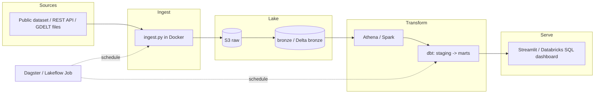

# Architecture

## Overview

One paragraph: the business question, the shape of the data, why this design.

## Diagram

## Data model

- **bronze**: raw, typed-as-string, partitioned by `ingest_date`.
- **silver / staging**: typed, deduped, cleaned; one model per source entity.
- **gold / marts**: business entities — `fct_*`, `dim_*`, `mart_*`.

## Design decisions

| Decision | Why | Trade-off |
|---|---|---|
| Athena over a warehouse | free-tier friendly, no cluster to run | slower, no constraints |
| dbt for transforms | tests + docs + lineage for free | another tool to learn |
| Small data slice | Databricks Free Edition quota | not a scale demo |

## Cost

How the design stays at ~$0 and how it's verified (Budget alarm, `terraform destroy`, data size).
